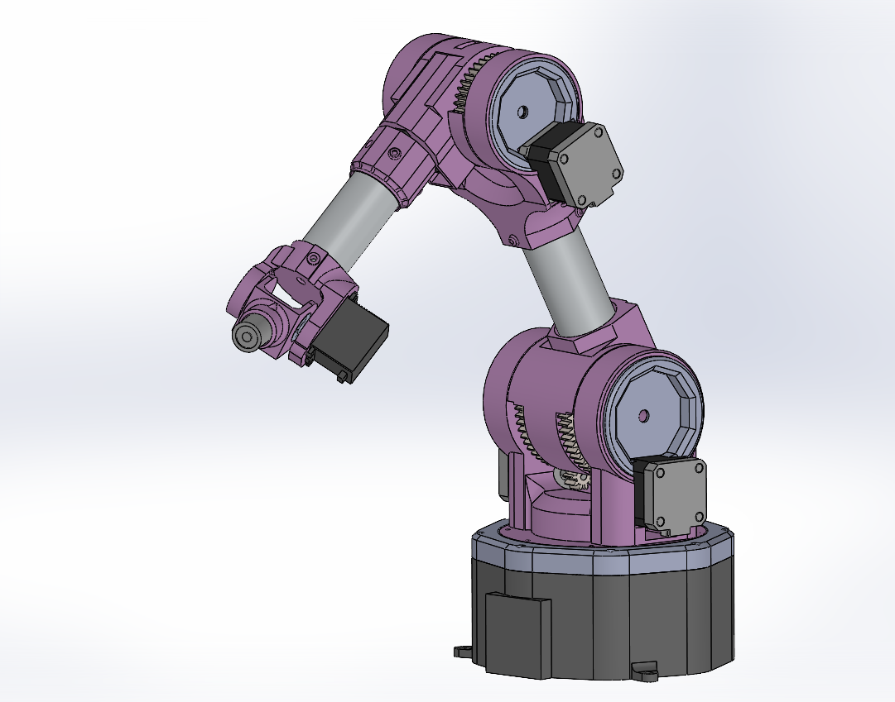
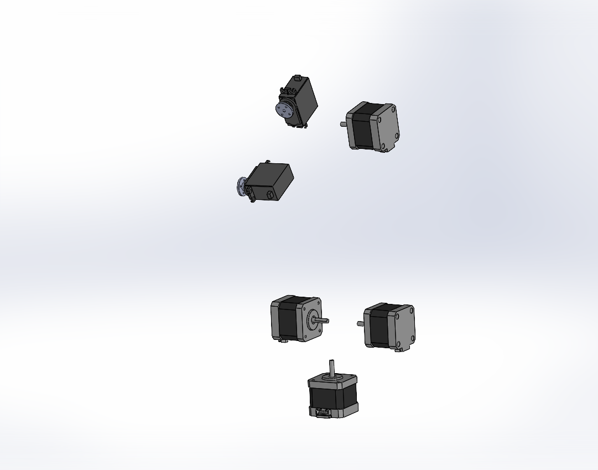
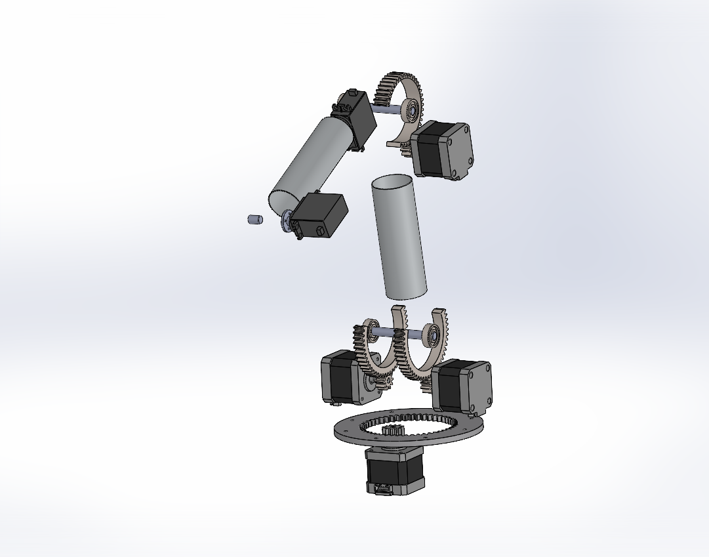
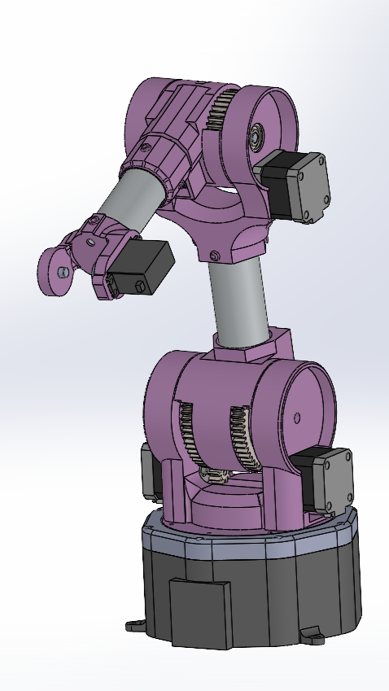

## About the Project
Welcome to the repository dedicated to the development of a 5-degree-of-freedom anthropomorphic robotic arm! This project aims to create a modular, fully 3D-printable, and open-source manipulator, making it accessible and reproducible for everyone.

The system uses stepper motors to ensure precise movements and features components manufactured through 3D printing. The hardware includes dedicated drivers and a control board to execute smooth trajectories with trapezoidal motion profiles.

In this repository, you’ll find everything you need: 3D models, electronic schematics, control code, and validation tests. Feel free to contribute, improve, and experiment! 

  

More pictures and videos in the media folder!

## 3D model made with solidworks

  
  
  
  

## Schematic

  

## Note
The V1.0_gripper is the main folder of the whole code, anyway you can see for trajectories tested example in the folder v1.0_traj or the 'interrupt_vers' if you're looking for the implementation based on all interrupts. 

If you don't want to use the trapezoidal profile just comment the code as mentioned above, be sure that the timers are set in interrupt mode and check for __HAL_TIM_Base_Start_IT 

## Additional info
Check out the report if you are interested in our work!

[Link to the report](Dr5_report.pdf)

[Link to the pinout and configuration](Dr5_pinout&configuration.pdf)
