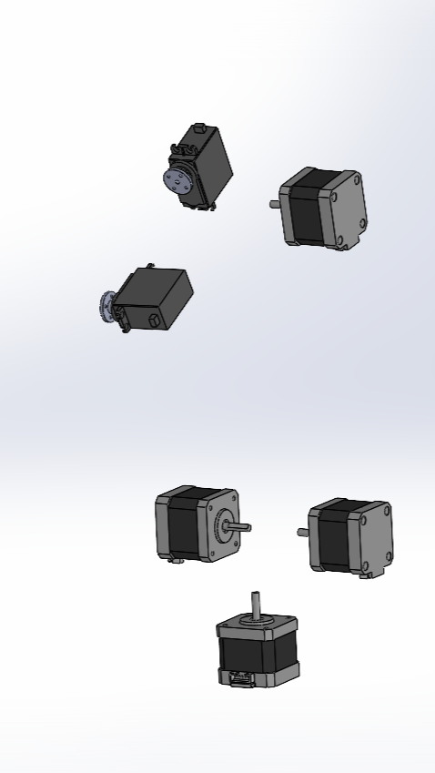
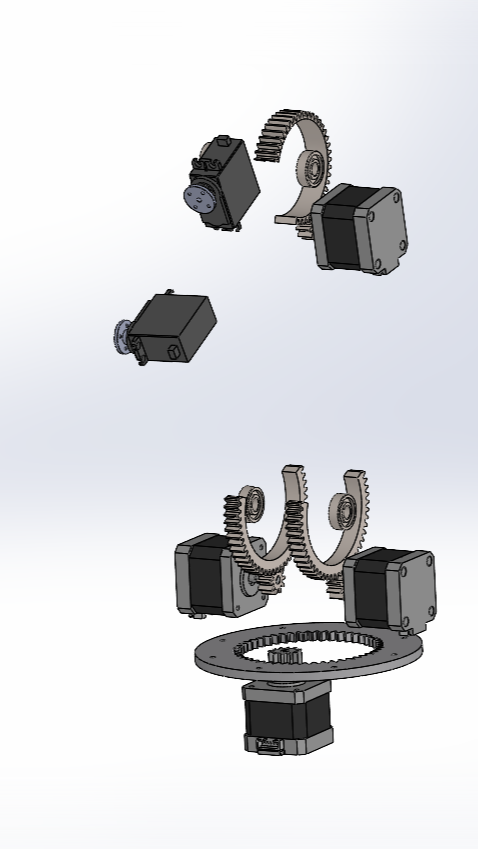
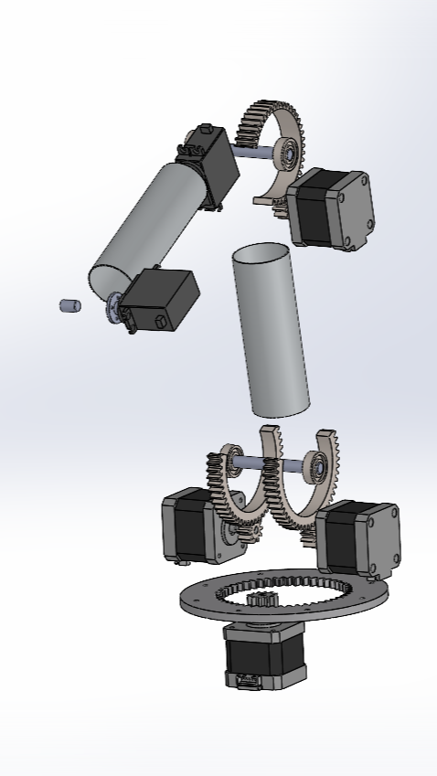

## About the Project
Welcome to the repository dedicated to the development of a 5-degree-of-freedom anthropomorphic robotic arm inspired by the robots Niryo Ned 2 and Kauda! This project aims to create a modular, fully 3D-printable, and open-source manipulator, making it accessible and reproducible for everyone.

The system uses stepper motors to ensure precise movements and features components manufactured through 3D printing. The hardware includes dedicated drivers and a control board to execute smooth trajectories with trapezoidal motion profiles.

In this repository, you’ll find everything you need: 3D models, electronic schematics, control code, and validation tests. Feel free to contribute, improve, and experiment! 

  

More pictures and videos in the media folder!

## 3D model made with Solidworks

  
  
  
  

## Schematic

  

## Software Notes

All software was developed on the STM32CubeIde and additionally the STM32CubeMx for configuration; for kinematics calculation, on the other hand, MATLAB and the Robotics System Toolbox were used. You may need to download this software in order to load the code properly.

The V1.0_gripper is the main folder of the whole code, anyway you can see for trajectories tested example in the folder v1.0_traj or the 'interrupt_vers' if you're looking for the implementation based on all interrupts. 

If you don't want to use the trapezoidal profile just comment the code as mentioned above, be sure that the timers are set in interrupt mode and check for __HAL_TIM_Base_Start_IT.

For the stepper motor the timers were configured in a chain with master-slave synchronization to count the steps taken according to the rising-edges of the pwm signal and slightly readjusted later to implement the trapezoidal profile. For full configuration details and code insights, links to pdfs are provided in the following section.

The stepper motor control libraries have been implemented to be as general as possible but still refer to the specific manipulator configuration, specifically: 
for joint 1 and joint 3, 1 motor is used; for joint 2, 2 mirrored motors are used, facing each other. Consequently in the stepper library and also partly in the trapezoidal control there are controls for the specific timer of joint 2, which has been treated differently as is the thought configuration. In case one wanted to change software configuration and use for example 1 channel (or 2) for all motors it would be enough to delete (or change) the controls within the libraries and the initial configuration with STM32CubeMx.

## Additional info
Check out the report if you are interested in our work!

[Link to the report](Dr5_report.pdf)

[Link to the pinout and configuration](Dr5_pinout&configuration.pdf)

## License 
Dracarys_5J © 2025 by Francesco Stasi, Davide Tonti is licensed under CC BY-NC-SA 4.0 

